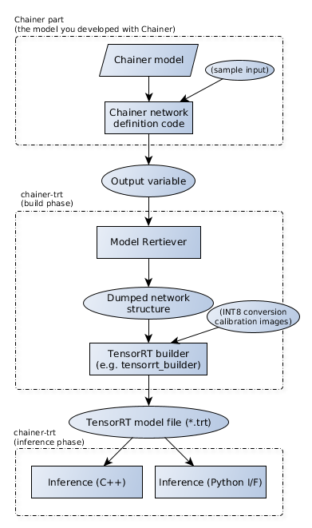
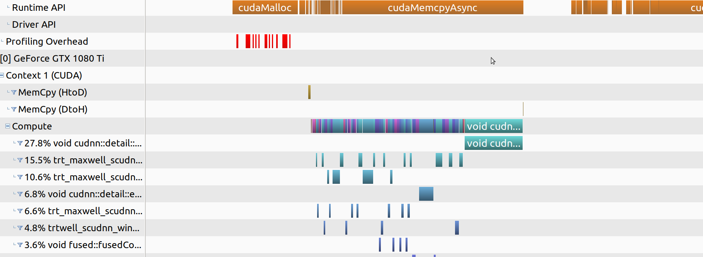
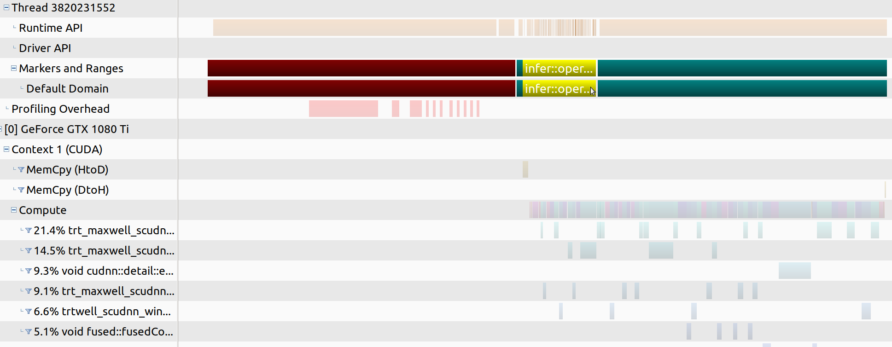

# chainer-trt

A toolkit for converting Chainer model to TensorRT inference engine, and run inference.

## Concept and overview




------
## System requirements

* Hardware requirements
  * NVIDIA GPU supported by NVIDIA TensorRT
    * Confirmed on Desktop PC and Jetson Xavier
* System requirements
  * NVIDIA TensorRT 5.0
  * CUDA 9.0 or newer
  * GCC5.4 or newer (Need C++14 support)
  * Python 3.6 or newer
  * Chainer v4 or newer
  * Google glog 0.3.5 or newer
* Optional requirements
  * pybind11 2.1.4 or newer
  * OpenCV 3.2 or newer (for ImageNet demo)
    * With Python interface
  * Google Test 1.8.0 (for automated tests)
  * Google Benchmark 1.3.0 or newer (for automated micro benchmarks)


------
## Getting started with a minimum example

Please make sure that you have already satisfied the "System requirements" above.

```bash
# Install necessary tools
% sudo apt install g++ cmake libgoogle-glog-dev libboost-all-dev libopencv-dev

% git clone git@github.com:pfnet-research/chainer-trt.git
% cd chainer-trt
% mkdir build; cd build
% cmake -DWITH_PYTHON_LIB=no -DWITH_TEST=no ..
% make
```

You will find libchainer_trt.so and libchainer_trt.a in the build directory.
They are the main library of chainer-trt.

Here is an example for building TensorRT inference engine of an ImageNet image classification network using chainer-trt.

```bash
% cd /path/to/chainer-trt       # If you're in the build directory, go back to root

# Get an example image
% wget -nv "https://upload.wikimedia.org/wikipedia/commons/thumb/4/4d/Cat_November_2010-1a.jpg/359px-Cat_November_2010-1a.jpg" -O cat.jpg

# Dump a Chainer-based pretrained network to an intermediate representation
% python example_imagenet/dump_chainer.py ResNet50Layers -r resnet50

# Build a TensorRT engine for the 0-th GPU, this may take a while
% ./build/example_imagenet/imagenet_tensorrt_builder/imagenet_tensorrt_builder -g 0 -i resnet50 -o resnet50/fp32.trt

# Run the built engine on the 0-th GPU with an image for 1000 times
% ./build/example_imagenet/imagenet_infer/imagenet_infer -m resnet50/fp32.trt -g 0 -i cat.jpg -n 1000
Using GPU=0 (Name="GeForce GTX 1080 Ti",CC=6.1, VRAM=11162MB)
Batch-size = 1
Loading model
Loading labels
Loading image
Send input to GPU
Average inference time = 2.596ms
Get output from GPU
0.457860 - tiger cat
0.326168 - tabby, tabby cat
0.204899 - Egyptian cat
0.001696 - lynx, catamount
0.000969 - plastic bag
```

For comparison, you can run Chainer-based inference with the same CNN.

```bash
% python example_imagenet/imagenet_infer_reference.py -m ResNet50Layers -i cat.jpg -n 1000 -g 0
Loading model
Loading labels
Loading image
Inference
Average inference time = 19.139971890000197ms
0.468369 - tiger cat
0.308983 - tabby, tabby cat
0.202293 - Egyptian cat
0.003273 - lynx, catamount
0.001592 - plastic bag
```

Please be noted that there can be some numerical differences between these
models results because non-determinant convolution algorithm can be
chosen through the optimization process in TensorRT.


------
## Components

chainer-trt consists of the following main components.


### ModelRetriever

The Python-side key component to dump a chainer-based neural network to an
intermediate representation.


### chainer-trt main library

Another key component in C++ side, which essentially wraps TensorRT C++ API.
It has interfaces for building a TensorRT inference engine, and interfaces for
running inference.


### Plugin libraries

TensorRT has a mechanism to insert custom layer implementations for layers
that are not natively supported by TensorRT.

chainer-trt provides various plugin implementations including
[Shift operation](https://docs.chainer.org/en/stable/reference/generated/chainer.functions.shift.html),
[Resize Images operation](https://docs.chainer.org/en/stable/reference/generated/chainer.functions.resize_images.html),
and so on.

These plugins can be automatically used when you use corresponding Chainer function in your forward-pass code.


#### Developing your own plugin

In case you need your own plugin, there are two ways.

* Implement it as a chainer-trt contribution
* Implement it outside chainer-trt and tell its existence to chainer-trt

If your plugin is generally useful and non-proprietary,
please consider implementing it as a part of chainer-trt plugin library,
so that anyone who uses chainer-trt can make use of it.
How to implement plugins inside chainer-trt can be learned by looking at
`src/include/plugins/(plugin_name).hpp` and `src/plugins/(plugin_name).cpp`,
also `src/plugins/plugin.cpp` to let chainer-trt recognize it.

Otherwise, in order not to disclose the detail of the plugin operator,
you can implement it *outside* chainer-trt inject to build and load process of an engine.
This is called *external plugins*.
The example `example_external_plugin` shows how to implement it.

In either cases, you need to follow these steps.

1. Implement a plugin class by `chainer_trt::plugin::plugin_base<T>`
  1-1. Implement CUDA kernels that operates the actual process
  1-2. Write sufficient tests to confirm the kernels work
2. Implement a builder function (`build_layer` in examples)
3. Register builder function and deserializer function to plugin factory
  3-1. In case of internal plugins, you can call it in ctor of `plugin_factory`
  3-2. In case of external plugins, you can register if after instantiating `plugin_factory`


### Chainer(Cupy) compatible inference interface

chainer-trt provides a thin wrapper of C++ interface so that you can
directly and easily call inference process from Python with numpy and cupy arrays.

    
------
## Installation detail

Currently, chainer-trt has to be built manually,
for both Python part and C++ part.


### Installing `ModelRetriever`

Python module including `ModelRetriever` has to be installed by setup.py
as follows.

```bash
% cd /path/to/chainer-trt
% pip install -e .
# OR
% python setup.py install
```

Then, please make sure if it's correctly installed.
```bash
% python -c "import chainer_trt"
```


### Installing main library

chainer-trt uses CMake to build.

```bash
% cd /path/to/chainer-trt
% mkdir build; cd build
% cmake -DWITH_TOOLS=YES ..
% make
% make install
```

You can switch which components to build by options.


#### Build tools (`-DWITH_TOOLS`, default=`YES`)

tools consist of a tiny conversion program to convert dumped chainer
model to TensorRT engine file.


#### Build ImageNet examples (`-DWITH_EXAMPLES`, default=`YES`)

ImageNet examples that are used in the quick start section.
Described in details later.
This requires OpenCV.


#### Build Python inference interface (`-DWITH_PYTHON_LIB`, default=`YES`)

A thin wrapper interface to bridge Python and C++ world.
This requires `Python.h` to be visible from compiler.
Run this command before cmake.
```
% export CPATH=$CPATH:\`python -c "import distutils.sysconfig; print(distutils.sysconfig.get_python_inc())"`
```
A shared object `libpyrt.so` will be created. This has to be in a location
visible from `PYTHONPATH` (not `LD_LIBRARY_PATH`).
You can confirm if Python can find and load it by
```python
% python -c "import chainer_trt; print(chainer_trt.is_python_interface_built)"
True
```
(If you got `False`, something is wrong).


#### Build Automated tests (`-DWITH_TEST`, default=`YES`)

Test of C++ part. This requires google glog and google test.


#### Automated micro benchmarks (`-DBENCHMARK`, default=`NO`)

In order to help optimizing plugin implementations, chainer-trt provides
several micro-benchmark codes.
This requires google glog and google benchmark.


#### nvprof profiling improvement (`-DWITH_NVTX`, default=`NO`)

An NVTX extension is built if this option is enabled.

nvprof (and nvvp) is very useful for performance analysis of CUDA kernels.
But they basically just show timeline of CUDA kernels,
which is sometimes difficult to know the semantic correspondence between timelines and codes
(especially with a black box, TensorRT).

NVTX is a CUDA API that allows user to show an arbitrary bar in nvvp profiling result.
chainer-trt's NVTX extension is to show additional timelines in NVTX
when running inference.


------
## Detailed flow

As shown in the above diagram and quick-start, workflow of chainer-trt has
the following steps.

Detailed explanation of each step is described in the later sections.


### (1) Model dump process

The first process is to convert a Chainer model to an intermediate representation.

Let's suppose you have a Chainer-based inference code,
next step is to let chainer-trt figure out structure of the computational graph
and its layers' parameters (weights), which we call "dump" process.

Here is a simple Python-based inference skeleton.

```python
import chainer

class Net(chainer.Chain):
    def __init__(self):
        ...
        
    def forward(self, x):
        h = f1(x)
        h = f2(h)
        return h

x = ...     # prepare input
with chainer.using_config('train', False):
    y = net(x)
print(y)    # show prediction
```

In order to dump the network to a file,
you just need to run forward pass with a dummy data once and
pass the output (whose type is `chainer.Variable` or `chainer.VariableNode`) to
chainer-trt (`ModelRetriever` object).

Then chainer-trt automatically retrieves every information that is needed
to describe about the network, and saves them to a destination directory.

```python
import chainer_trt

x = chainer.Variable(np.random.random((1, 3, 10, 10)))        # something dummy input

retriever = chainer_trt.ModelRetriever("dump_out")
retriever.register_inputs(x, name="input")
with chainer.using_config('train', False):
    with chainer_trt.RetainHook():
        y = net(x)

retriever(y, name="prob")
retriever.save()
```

The output `"dump_out` is a directory including the following files.

* `model.json`: Describes network structure including input and output
* `*.weights`: Parameters of each layers. e.g. One Conv layer may have 2 weight files for conv parameter and bias values


### (2) Build TensorRT engine

After getting an intermediate representation of your NN,
the next step is to build an inference engine.

This step is in C++ world.

```cpp
#include <chainer_trt/chainer_trt.hpp>
...

auto m = chainer_trt::model::build_fp32("dump_out",
                                        4.0,   // workspace size in GB
                                        1);    // max batch size
m->serialize("fp32.trt");
```

You can simply call `chainer_trt::model::build_fp32` with directory name
of the intermediate representation, and call `serialize` to save it to a file.

Build process does device-independent and device-specific optimization,
explained in [Deploying Deep Neural Networks with NVIDIA TensorRT](https://devblogs.nvidia.com/deploying-deep-learning-nvidia-tensorrt/).

**FP16 mode**
`build_fp16` is also available to build FP16 mode inference engine.
With natively supported hardware like V100, it brings significant speedup,
but otherwise it doesn't, moreover it just increases type conversion overhead.

**INT8 mode**
To build INT8 mode, you need to call `build_int8` with *calibration datasets*.
TensorRT provides calibration mechanism to intelligently identify the
quantization criteria for each layer based on the actual data.
So you need to implement a task-specific stream class that feeds the actual
data one after another to build an inference engine with INT8 mode.
This is explained in detail in the later section.

Be noted that the built engine file is *NOT* compatible with any other environment,
since it is optimized specifically for your GPU, system, and environment.

So if you need to build inference engine for several environments,
you need to run the build process on each of them.
Dump process is environment-independent, so you need to do only once and re-use.

Also, a simple default builder tool that only supports FP32 and FP16
is already provided (you can find it in `tools/` directory).

After building chainer-trt, running this tool builds the model.

```bash
% ./build/tools/tensorrt_builder/tensorrt_builder -i dump_out -o fp32.trt
```

This tiny tool is perfectly enough as long as you use only FP32 and FP16 mode.


### (3a) Run inference (from C++ code)

The next step is to run inference.
This section explains how to run inference from C++.

First load a model and initialize an engine.

```cpp
#include <chainer_trt/chainer_trt.hpp>

// This part is needed if you specify in/out name by name with string literals
#include <string>
using namespace std::literals::string_literals;

...

auto m = chainer_trt::model::deserialize("fp32.trt"); 
chainer_trt::infer rt(m);
```

Then, load an input to a host-side buffer and call `infer_from_cpu` to get inference result.

```cpp
float* x = new float[...];  // input
float* y = new float[...];  // output

for(;;) {
    // load input data to x
    load_input(x, ...);
    
    rt.infer_from_cpu(1,        // batch size
                      {{"input"s, x}},
                      {{"prob"s, y}});
                      
    // here, y has output values
}
```

CUDA stream can also be used to overlap inference processes.

```
cudaStream_t s;
cudaStreamCreate(&s);
rt.infer_from_cpu(1, {{"input"s, x1}}, {{"prob", y1}}, s);
rt.infer_from_cpu(1, {{"input"s, x2}}, {{"prob", y2}}, s);
```

But be careful that multiple inference processes with single `chainer_trt::infer`
instance **cannot** be ran from the same thread, as it is not thread safe.

In case you want to run multi-threaded inference,
you have to instantiate `chainer_trt::infer` for each worker.
Refer the ImageNet example below for more details.


#### Efficient memory control (`chainer_trt::buffer`)

Every time `chainer_trt::infer::infer_from_cpu` is called,
it allocates GPU memory for input and output and deallocate after inference,
which is less efficient.

`chainer_trt::buffer` provides a simple way to manage GPU buffers and
keep them alive as long as needed.


```cpp
chainer_trt::infer rt(m);
auto buf = rt.create_buffer(1);     // allocates GPU memory

float* x = new float[...];  // input on CPU side
float* y = new float[...];  // output on CPU side

for(;;) {
    // load input data to x
    load_input(x, ...);
    
    buf->input_host_to_device({{"input", x}});
    rt(*buf);   // run inference
    buf->output_device_to_host({{"prob", y}});
}
```

Since GPU memories are allocated before the inference loop,
memory allocation overhead won't happen.
By using `buffer`, you don't have to manually and separately allocate GPU memory and manage them.


#### Manual buffer control

`chainer_trt::buffer` assumes that you don't have any preprocessing and postprocessing
on GPU side before and after the inference process.
So this is sometimes less flexible in case you need to modify input and/or outputs on GPU.

In such case, manual memory control is needed.

```cpp
float* x = new float[...];
float* x_gpu;
cudaMalloc(&x_gpu, sizeof(float) * ....);
float* y_gpu;
cudaMalloc(&y_gpu, sizeof(float) * ....);

for(;;) {
    // load input data to x
    load_input(x);
    
    // send it to GPU
    cudaMemcpy(x_gpu, x, sizeof(float) * ...., cudaMemcpyHostToDevice);
    
    // do some preprocessing on GPU
    preprocessing(x_gpu);
    
    // run inference (call chainer_trt::infer::operator())
    rt(1, {{"input", x_gpu}}, {{"output", y_gpu}});
    
    // do some postprocessing on GPU
    postprocessing(y_gpu);
    
    cudaMemcpy(y, y_gpu, sizeof(float) * ...., cudaMemcpyDeviceToHost);
}
```


### (3b) Run inference (from Python)

chainer-trt also provides an interface to run inference from Python code.

This interface accepts both numpy array and cupy array,
and if numpy arrays are specified as inputs, returned value will be a list of
numpy arrays, and vice versa.

```python
import chainer_trt

# load an inference engine
infer = chainer_trt.Infer("fp32.trt")

x = cupy.array()  # prepare a data. numpy.array is also OK

# run inference
y = infer({'input': x})['prob']
#y = infer([x])[0]      # this is also OK

# here, y has output values
```

From performance perspective, writing everything in C++ and
kicking the inference from there would be the best,
but in some cases it is very useful if we can directly call
highly optimized inference from Python,
e.g. when integrating TensorRT in a web system.


------
## ImageNet example details

Examples in example_imagenet explains how to dump Chainer-based models, build them and efficiently running inference.

| Code                              | Description                                                                                       |
|:----------------------------------|:--------------------------------------------------------------------------------------------------|
| dump_chainer.py                   | A simple tool to dump Chainer-predefined ImageNet                                                 |
| dump_caffemodel.py                | *not well-tested* An example to dump caffemodel using Chainer's CaffeFunction                     |
| imagenet_tensorrt_builder/        | Inference engine builder for ImageNet, with INT8 calibration support                              |
| imagenet_infer/                   | An example of single-image inference, useful for inference latency benchmark                      |
| imagenet_infer_fast/              | An example of high-throughput inference example, useful for throughput benchmark                  |
| imagenet_infer_reference.py       | Chainer-based single-image inference example (equivalent to imagenet_infer), for checking result  |
| imagenet_infer_reference_eval.py  | Chainer-based high-throughput inference example (equivalent to imagenet_infer_fast)               |
| imagenet_infer_tensorrt.py        | An example of running TensorRT inference from Python                                              |

In the following sections, you are assumed to have built chainer-trt in `build` directory in chainer-trt root.


### Example 1: Building an inference engine of chainer-predefined ImageNets

The very basic usage of ImageNet example is shown in quick start section.
here explains a bit more details.

#### Dump model

First of all you have to dump a Chainer-based model to an intermediate representation.
This process itself doesn't require TensorRT in your system, since it just traces computational graphs and saves to files.

```bash
% python dump_chainer.py ResNet50Layers -r resnet50
```

The supported chainer-predefined ImageNet classified models are
`ResNet50Layers`, `ResNet101Layers`, `ResNet152Layers`, `VGG16Layers` and `GoogLeNet`,
which are implemented in `chainer.links`.

Be noted that you may have to manually prepare pretrained weights file in advance (ResNets).

##### Include preprocessing in computational graph

`dump_chainer.py` not only just dumps the core CNN, it also includes mean subtraction in the dumped computational graph
and transposing HWC to CHW order.

Usually ImageNets assume input images to be zero-mean and its order is CHW format, with user's responsibility.
But in this example, these preprocessings are done as a part of computational graph,
so you can directly feed raw images loaded from disk into CNN (you still need to convert data to float32, though).

The important point here is that you have to make input `chainer.Variable` **before**
applying operations that you'd like to include in the dump.
Otherwise these operations are not recorded in the computational graph.

```python
x = chainer.Variable(x)     # <-----
...
mean = numpy.array([103.939, 116.779, 123.68]).astype(numpy.float32)
...
x = x.transpose((0, 3, 1, 2))   # hwc2chw
x = x - mean
```


##### Tell what is the input

Another important point is that you also have to tell `ModelRetriever` which Variable is the input,
because from computational graph point of view, both `x` and `mean` in the above example are the
terminal node, and there's no way to know which is the input.

So you have to explicitly let it know.
Be noted that `x` here needs to be `chainer.Variable` rather than numpy/cupy array.

```python
retriever.register_inputs(x)
```

If you forget doing this, chainer-trt will treat both `x` and `mean` as input,
thus you will have to feed not only input image but also mean value array.

In the `dump_chainer.py`, name option is fed to `register_inputs`,
so that you can specify input data by name during inference.
This is useful if your NN has multiple inputs.
If name is not specified, chainer-trt automatically decides name for that input.

```python
retriever.register_inputs(x, name="input")
```


##### Verbose mode

`ModelRetriever` supports verbose mode, and this can be enabled by `--verbose` option to `dump_chainer.py`.

In verbose mode, the following
* `ModelRetreiver__call__` will print layer name it has detected to stdout.
* In dump destination directory,
  * All the input and output values of each layer are saved, and `model.json` will include filename of them, which is useful for debug purpose
  * `model.json` will be prettified
  * Visualized computational graph using `chainer.computational_graph` is saved


#### Build an inference engine

Next step is to build an inference engine.

```bash
% ./build/example_imagenet/imagenet_tensorrt_builder/imagenet_tensorrt_builder -i resnet50 -o resnet50/fp32.trt
```

This tiny tool is basically just to call `chainer_trt::model::build_{fp32/fp16/int8}`,
so regarding the options for workspace size (`--workspace`, `-w`) and max batch size (`--max-batch`, `-b`),
please refer the above sections.

TensorRT uses a device currently active (set by `cudaSetDevice`) and optimizes inference engine for that particular device.
`imagenet_tensorrt_builder` has an option `--gpu` (`-g`) option, where you can specify on which GPU your inference engine will run.

With `--mode fp32` (default) and `--mode fp16`, you don't need anything additionally.
`--mode int8` requires an additional option, which is exlpained in detail in "Example 2: Building INT8 TensorRT engine".


#### Run the built inference engine

The simplest example of running inference is `imagenet_infer`.

```
% ./build/example_imagenet/imagenet_infer/imagenet_infer -m resnet50/fp32.trt -i cat.jpg -n 1000
```

This tool measures average inference time for each batch,
*without* data transfer between host and GPU.
So the result can be a minimum latency of your model on your device.

It also has an option `--gpu` (`-g`). The same GPU must be specified in build phase and inference phase.


##### Layer-wise profiling

By adding `--prof` option to `imagenet_infer`,
it reports layer-wise execution time in the specified format as follows (`md` (markdown table) and `csv` are supported).

```
% ./build/example_imagenet/imagenet_infer/imagenet_infer -i cat.jpg -m resnet50/fp32.trt -n 1000 --prof md
...
| Layer name                                           | #call |   total ms |  ms/call |        % |
|:-----------------------------------------------------|:------|:-----------|:---------|:---------|
| ConstantInput-0                                      |  1000 |    1.23405 |  0.00123 |   0.044% |
| Transpose-0-1                                        |  1000 |   13.49645 |  0.01350 |   0.481% |
| Sub-1-1                                              |  1000 |    6.73158 |  0.00673 |   0.240% |
| Convolution2DFunction-2-1 + ReLU-4-1                 |  1000 |   45.12035 |  0.04512 |   1.607% |
| MaxPooling2D-5-1                                     |  1000 |   15.57731 |  0.01558 |   0.555% |
| Convolution2DFunction-6-2 + ReLU-8-1                 |  1000 |   19.45376 |  0.01945 |   0.693% |
| Convolution2DFunction-9-1 + ReLU-11-1                |  1000 |   26.27018 |  0.02627 |   0.936% |
| Convolution2DFunction-12-1                           |  1000 |   26.15917 |  0.02616 |   0.932% |
...
```


### Example 2: Building INT8 TensorRT engine

This section explains how to build an INT8 inference engine.

In TensorRT, post-training quantization is realized as explained in
[8-bit Inference with TensorRT](http://on-demand.gputechconf.com/gtc/2017/presentation/s7310-8-bit-inference-with-tensorrt.pdf).

In order to build INT8 mode ImageNet inference engine with `imagenet_tensorrt_builder`,
first you have to prepare a list of calibration images.

Calibration images used for obtaining layer-wise distribution of activations,
so they have to be sampled practical images, preferably part of data used for training the model.

```bash
% tree /path/to/ILSVRC2012/train | grep 'jpeg$' | shuf | head -n 1000 > calib.list
```

The appropriate size of calibration set depends on task, model and so on, but typically 10^3~10^4 order is enough.

In dump phase, you don't need anything special.
So now you can run the build process.

```bash
% ./build/example_imagenet/imagenet_tensorrt_builder/imagenet_tensorrt_builder \
    -i resnet50 -o resnet50/int8.trt --mode int8 --calib calib.list
```

This takes a few minutes (depends on model, hardware ability and size of calibration set).
After the build process completed, you can run it similarly as the engine built with fp32 and fp16.

```bash
% ./build/example_imagenet/imagenet_infer/imagenet_infer -i cat.jpg -m resnet50/int8.trt -n 100Using GPU=0 (Name="GeForce GTX 1080 Ti",CC=6.1, VRAM=11162MB)
Batch-size = 1
Loading model
Loading labels
Loading image
Send input to GPU
Average inference time = 0.864
Get output from GPU
0.459342 - tiger cat
0.321516 - tabby, tabby cat
0.212346 - Egyptian cat
0.001113 - lynx, catamount
0.000704 - tiger, Panthera tigris
```


##### Implementing calibration stream

Since calibration is task specific and model specific,
you will have to implement your own class to feed calibration image to TensorRT builder,
which we call calibration stream.

`imagenet_tensorrt_builder` implements a simple example of calibration stream.
It receives a list of filename of images as a calibration set,
and every time `get_batch` is called, it loads the next data to the designated buffer.

Minimum skeleton is like this.

```cpp
class my_calib_stream : public chainer_trt::calibration_stream {
public:
    my_calib_stream(...) {...}

    virtual int get_n_batch() override { return number_of_samples; }
    virtual int get_n_input() override { return number_of_inputs; }

    virtual void get_batch(int i_batch, int input_idx,
                           const std::vector<int>& dims,
                           void* dst_buf_cpu) override {
        // load input_idx-th input of i_batch-th data
        // to dst_buf_cpu
    }
```

ImageNets have only one input, so `get_batch` is called only once for each calibration data,
but if your network has multiple inputs, `get_batch` is called for each input for each data.


##### Calibration cache

The build process with INT8 calibration is very time-consuming,
but the calibration information (distribution of activations) are not device-dependent,
so TensorRT provides a way to re-use previous result of calibration to save build time.

```bash
# Build INT8 engine with a calibration cache
% ./build/example_imagenet/imagenet_tensorrt_builder/imagenet_tensorrt_builder \
    -i resnet50 -o resnet50/int8.trt --mode int8 --calib calib.list \
    --out-cache resnet50/calib_cache.dat

# Once you have made a cache, you don't need to specify calibration set, but just need the cache
% ./build/example_imagenet/imagenet_tensorrt_builder/imagenet_tensorrt_builder \
    -i resnet50 -o resnet50/int8.trt --mode int8 --in-cache resnet50/calib_cache.dat
```

When implementing a calibration stream, you don't need anything to support calibration cache.


### Example 3: Running inference from Python

chainer-trt provides a thin wrapper interface to run inference from Python side.
`imagenet_infer_tensorrt.py` shows a simple example of how to use this.

Before running it, please make sure that `libpyrt` is correctly built and
visible from Python interpreter (see the chainer-trt build section).

Dump process and build process are the same as above examples.

```bash
% python example_imagenet/imagenet_infer_tensorrt.py -m resnet50/fp32.trt -i cat.jpg
Batch size = 1
Loading model
Loading labels
Loading image
Mode: directly feed cupy array
Inference
Average inference time (not including CPU->GPU transfer) = 3.8590860003751004ms
0.468369 - tiger cat
0.308983 - tabby, tabby cat
0.202293 - Egyptian cat
0.003273 - lynx, catamount
0.001592 - plastic bag
```

`libpyrt` has the following modes.

**(1) Call `chainer_tensorrt.Infer.__call__` with numpy array**

chainer-trt automatically sends the data from CPU to GPU,
runs inference, and bring the result back to CPU as `numpy.array`.
This is equivalent to chainer-trt C++ interface `chainer_trt::infer::infer_from_cpu`.
  

**(2) Call `chainer_tensorrt.Infer.__call__` with cupy array**

Rather than `numpy.array`, you can also pass `cupy.array`.
The result is also `cupy.array`, so data transfer between CPU and GPU won't happen.
This is equivalent to chainer-trt C++ interface `chainer_trt::infer::operator()` with raw pointers.


**(3) Call `chainer_tensorrt.Infer.__call__` with cupy array**

The above (1) and (2) dynamically allocate memory several times.
In order to reduce this overhead, `chainer_trt.Buffer` is available,
which is equivalent to `chainer_trt::buffer`.


`imagenet_infer_tensorrt.py` supports these 3 modes, with `--mode {cupy|numpy|buffer}`.


### Example 4: High-throughput inference

In case inference throughput is more important than latency,
batch-nization and concurrent execution are effective (c.f. [Best Practices For TensorRT Performance](https://docs.nvidia.com/deeplearning/sdk/tensorrt-best-practices/index.html))
`imagenet_infer_fast` is an example of such a high-throughput inference.
This tools evaluates the classification accuracy of a model using ImageNet validation images.

First you need to prepare for a validation images in `chainer.datasets.LabeledImageDataset` format like below.

```
val/ILSVRC2012_val_00000001.JPEG 65
val/ILSVRC2012_val_00000002.JPEG 970
val/ILSVRC2012_val_00000003.JPEG 230
val/ILSVRC2012_val_00000004.JPEG 809
val/ILSVRC2012_val_00000005.JPEG 516
val/ILSVRC2012_val_00000006.JPEG 57
val/ILSVRC2012_val_00000007.JPEG 334
...
```

Each line consists of a relative path to the image from a certain root directory (here I call `$ILSVRC2012_ROOT`) and ground truth label index.
Save this list as `val.txt`.

You also need to build an inference engine built with large batch size like 8 or 16 (please refer to the above examples).

```bash
% ./build/example_imagenet/imagenet_tensorrt_builder/imagenet_tensorrt_builder -i resnet50 -o resnet50/fp32_b8.trt -b 8
```

Now, run the high-throughput inference.
In this case, 8-parallel inference worker thread will run, and each worker runs inference with batch-size 8.

```bash
% ./build/example_imagenet/imagenet_infer_fast/imagenet_infer_fast -m resnet50/fp32_b8.trt -i val.txt -p $ILSVRC2012_ROOT -n 8 -b 8
Using GPU=0 (Name="GeForce GTX 1080 Ti",CC=6.1, VRAM=11162MB)
Running inference
top1 accuracy 67.148%
top5 accuracy 87.018%
total time 53.1014s
average time 8.496ms/batch (1.062ms/image)
```

During the inference loop, you can see that GPU is completely occupied in nvidia-smi command if your disk is fast enough.

```bash
% nvidia-smi
+-----------------------------------------------------------------------------+
| NVIDIA-SMI 410.48                 Driver Version: 410.48                    |
|-------------------------------+----------------------+----------------------+
| GPU  Name        Persistence-M| Bus-Id        Disp.A | Volatile Uncorr. ECC |
| Fan  Temp  Perf  Pwr:Usage/Cap|         Memory-Usage | GPU-Util  Compute M. |
|===============================+======================+======================|
|   0  GeForce GTX 108...  Off  | 00000000:01:00.0  On |                  N/A |
| 32%   62C    P0   255W / 250W |   3386MiB / 11162MiB |    100%      Default |
+-------------------------------+----------------------+----------------------+
```


#### Implementing concurrent inference

In case implementing multi-thread concurrent inference,
`chainer_trt::model` can be re-used for multiple workers,
thus it needs to be loaded only once at the very beginning of the program.

In contrast, `chainer_trt::infer` is *not thread* safe and *must be initialized for each worker*.


#### Python-based high-throughput inference (reference implementation)

`imagenet_infer_reference_eval.py` does the same thing in Chainer's world.

```bash
% python example_imagenet/imagenet_infer_reference_eval.py -m ResNet50Layers -i val.txt -p $ILSVRC2012_ROOT -n 8 -b 8 
Top1 accuracy = 67.148%
Top5 accuracy = 87.018%
Total time = 94.63s
Average time = 15.141ms/batch, 1.893ms/image
```


------
## YOLOv2 example details

There is a simple YOLOv2 object detection example in `example_yolo`.

How this example is made is basically same as ImageNet examples explained above.

```python
# Dump network structure
% python example_yolo/dump_yolo.py --gpu 0

# Build an inference engine
% tensorrt_builder -i dump_yolo -o dump_yolo/fp32.trt

# Run inference
% python example_yolo/yolo_infer_tensorrt.py --engine dump_yolo/fp32.trt cat.jpg -n 1000 
Loaded TensorRT inference engine dump_yolo/fp32.trt                                                                                     │rm 'test/fixtures/tensorrt_model/leaky_relu/leaky_relu_slope04/in.csv'
8.801ms/img

# Also detection will be displayed
```

If you don't specify `--engine` option to `yolo_infer_tensorrt.py`,
it will run inference based on default (chainer-based) model,
so that you can compare the results.


------
## Profiling support

### nvprof/NVVP profiling support

If `-DWITH_NVTX=YES` is specified when building chainer-trt,
it enables NVVP (Nvidia Visual Profiler) visualization improvement.

NVTX is a CUDA API to allow show arbitrary time line in NVVP.

By default, without NVTX, NVVP profiling visualization of ImageNet inference
will be like this.
(Be noted that nvprof/nvvp can still be used without chainer-trt built with `-DWITH_NVTX=YES`)




When NVTX hook is enabled, there will be timelines semantically meaningful
along with CUDA kernels.
(Note: There could be a gap with timeline of CUDA kernels,
because of asynchronous execution.)




You can use this to visualize your own time line in NVVP.
(Be noted that `nvtx_profile`, not `chainer_trt::nvtx_profile`)

```cpp
#include <chainer_trt/profiling.hpp>
#define WITH_NVTX

nvtx_profile("running inference") {
    rt(*buf);
}
```

If a macro `WITH_NVTX` is defined before `nvtx_profile` is called,
timeline using NVTX API is enabled,
otherwise it is simply ignored with no overhead.


### Layer-wise profiling

As already shown in the Examples sections above, 
TensorRT provides a simple mechanism in order to measure layer-wise execution time.
By using this feature, you can analyze which layers are actually time-consuming
in the neural network level, rather than CUDA kernel level.

You just need to create an instance of `chainer_trt::default_profiler` and
pass it to constructor of `chainer_trt::infer`.

```cpp
auto prof = std::make_shared<chainer_trt::default_profiler>();
chainer_trt::infer rt(m, prof);

// run inference loop
for(...) {
    rt(...);
}

prof->show_profiling_result(std::cout, "md");
```

During inference loop it accumulates execution time for each layer inside.
After the loop finished, it shows the report in markdown table format.

An example of code and usage is shown in Examples section.


------
## Debug support

In case a network has some issues when building inference engine TensorRT will raise errors with layer name.
But just a layer name and an internal error message reported by TensorRT runtime might not be informative enough
to know what exactly is happening.

The problem here is that it could be quite difficult for users to know which part in Python code
caused the trouble even if name of the guilty layer is reported,
because name of layer is automatically determined by chainer-trt.

To address this issue, chainer-trt (`chainer_trt.ModelRetriever`)
provides the following mechanisms.


### `MarkPrefixHook`

This hook is to add a prefix to automatically-determined name of layers executed
during the lifetime of hook object.

```python
x = ...
with chainer.using_config('train', False), chainer_trt.RetainHook():
    with chainer_trt.MarkPrefixHook('preprocessing'):
        x = F.transpose(x, ...)
        x = x - mean
    with chainer_trt.MarkPrefixHook('main'):
        y = net(x)
retriever(y)
```

In `model.json` in the dump destination directory, you will see layers named like below.

```
preprocessing-Transpose-0-1
preprocessing-Sub-1-1
main-cnn-Convolution2DFunction-2-1
main-cnn-FixedBatchNormalization-3-1
main-cnn-ReLU-4-1
...
```

If you have some troubles reported during build process and it reports only layer name,
you can apply this hook to suspicious part in your Python forward-pass code.

Another use-case of `MarkPrefixHook` is profiling a certain part of NN.
Since TensorRT runs the entire NN as a black box, we cannot directly know
how long a certain part of the NN takes.

By adding a prefix to every layers in a certain part of a NN
and use **layer-wise profiling** feature explained above,
you can get information about the execution time of the part.


### `TracebackHook`

If this hook is used, all the function (`chainer.Function`) call is
recorded with traceback, and is saved in `model.json`.
So if you have a layer name causing an error, you can immediately identify
which part in Python code is causing the error.

```python
x = ...
with chainer.using_config('train', False), chainer_trt.RetainHook():
    with chainer_trt.TracebackHook():
        x = F.transpose(x, ...)
        x = x - mean
        y = net(x)
retriever(y)
```

In `model.json` in the dump destination directory, you will see layer with `"traceback"` field like below.

```
    {
      "type": "Transpose",
      "name": "Transpose-0-1",
      "rank": 0,
      "source": "input-0",
      "axes": [
        2,
        0,
        1
      ],
      "traceback": "File \"example_imagenet/dump_chainer.py\", line 42, in <module>\n    x = x.transpose((0, 3, 1, 2))   # hwc2chw\n  File \"xxxx/lib/python3.6/site-packages/chainer/variable.py\", line 1096, in transpose\n    return chainer.functions.transpose(self, axes)\n  File \"xxxx/lib/python3.6/site-packages/chainer/functions/array/transpose.py\", line 72, in transpose\n    return Transpose(axes).apply((x,))[0]"
    },
```


------
## Development

### Testing

chainer-trt has tests for Python (dump) part and C++ (main library).
Python part is not well-tested, but this is going to be improved.

#### Python part

In Python part (mainly `ModelRetriever`), there are some test cases on top of pytest.
When implementing some new features in Python side, please make sure the test passes.

Currently there is only a few tests. It's work in progress.

```python
% python -m pytest
```

#### C++ main library part

In C++ part, there are quite a lot of test cases on top of google testing framework.
In order to run the test, you have to install google test and build chainer-trt
with `-DWITH_TESTS=YES` option.

(Pitfall: in Ubuntu, `apt install libgtest-dev` only installs headers and sources,
so you need to build it.)

When implementing some new features in C++ side, please make sure the test passes.

```bash
% ./build/test/test_chainer_trt
```


### Code format

#### Python part

Python codes are in `python` and `example_imagenet` directories.
Run flake8 to check code format.
No warning should be reported.

```bash
% flake8 python test example_imagenet example_yolo
```

#### C++ main library part

In C++ part, we use `clang-format-6.0` with the project [.clang-format](.clang-format).

```bash
% clang-format-6.0 -i /path/to/cpp/file
```

C++ codes (.cpp and .hpp) have to be formatted.

As for automatically generated C codes (created by gengetopt),
you don't have to reformat them.
For CUDA codes (.cu), since clang-format doesn't understand CUDA-specific syntax,
you don't have to be keen for prettification, but it is much appreciated to
try clang-format and follow the advice if useful.


### Micro-benchmark of plugins

chainer-trt provides various custom operator implementations as
TensorRT's plugin.
Since optimizing its performance is chainer-trt developer's responsibility,
there is a reproducible micro-benchmark samples.

This requires [google benchmark library](https://github.com/google/benchmark),
and chainer-trt built with `-DWITH_BENCHMARK=YES` option
(this is by default `OFF` so you need to explicitly enable it).

```
# When running a particular benchmark case
% ./build/benchmark/bench --benchmark_filter="shift"
Running ./benchmark/bench
Run on (8 X 4500 MHz CPU s)
CPU Caches:
  L1 Data 32K (x4)
  L1 Instruction 32K (x4)
  L2 Unified 256K (x4)
  L3 Unified 8192K (x1)
***WARNING*** CPU scaling is enabled, the benchmark real time measurements may be noisy and will incur extra overhead.
***WARNING*** Library was built as DEBUG. Timings may be affected.
------------------------------------------------------------------------------
Benchmark                                       Time           CPU Iterations
------------------------------------------------------------------------------
benchmark_shift_float/9/8/8/3/1              7455 ns       7455 ns      89274
benchmark_shift_float/9/8/8/3/2              7525 ns       7525 ns      94409
benchmark_shift_float/9/8/8/3/3              7046 ns       7046 ns      94236
benchmark_shift_float/25/8/8/5/1             7571 ns       7571 ns      92056
benchmark_shift_float/25/8/8/5/2             7206 ns       7206 ns      90150
benchmark_shift_float/25/8/8/5/3             7241 ns       7241 ns     102885
benchmark_shift_float/9/32/32/3/1            8075 ns       8075 ns      78097
benchmark_shift_float/9/32/32/3/2            8375 ns       8374 ns      81950
benchmark_shift_float/9/32/32/3/3            7754 ns       7754 ns      83699
...

% ./build/benchmark/bench
...
```

When you implement a new custom plugin and it could be a crucial part
in terms of performance, it doesn't have to be well optimized from the beginning,
but it is suggested to provide some benchmark cases in order to help
future optimization.


------
## Acknowledgments

This repository includes source code of
[picojson](https://github.com/kazuho/picojson) (Copyright 2011-2014 Kazuho Oku),
which is provided in the following 2-clause BSD license.

Redistribution and use in source and binary forms, with or without
modification, are permitted provided that the following conditions are met:
1. Redistributions of source code must retain the above copyright notice,
   this list of conditions and the following disclaimer.
2. Redistributions in binary form must reproduce the above copyright notice,
   this list of conditions and the following disclaimer in the documentation
   and/or other materials provided with the distribution.
